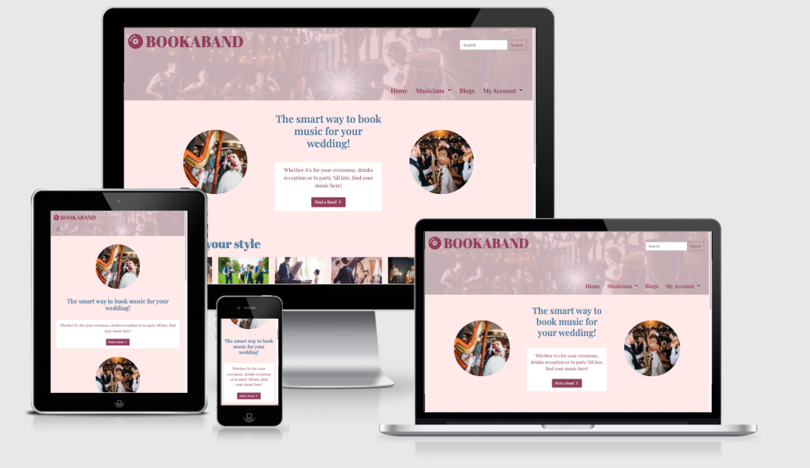
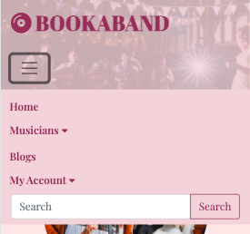
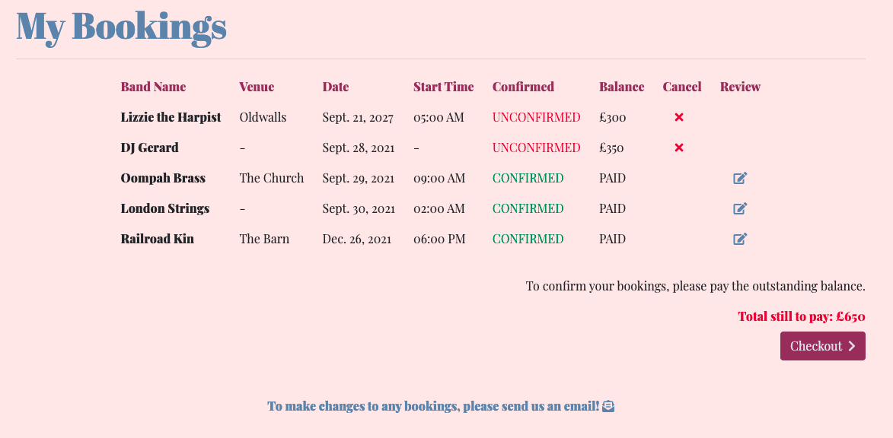

# BOOK A BAND

 

[&#127926;  &nbsp; **View Live Website**  &nbsp; &#127926;](https://bookaband.herokuapp.com/)

 

[&#127928;  &nbsp; **View GitHub Repository** &nbsp; &#127928;](https://github.com/OliHickie/book_a_band)

 

Book a Band is an e-commerce website designed to help users plan and book musical entertainment for their wedding day. The site offers users an easy booking system which allows them to book a variety of acts, as well as view all bookings in one easy place. 

The website is built using the Django framework alongside Bootstrap and jQuery, with the checkout process provided by Stripe. Static files are hosted by Amazon Web Services and the site is deployed on Heroku. This website was created as part of my Full Stack Web Developer Diploma with Code Institute.

# Contents

1) [User Experience](#user-experience)
2) [Features](#features)
3) [Technologies](#technologies)
4) [Testing](#testing)
5) [Deployment](#deployment)
6) [Credits](#credits)

 

# User Experience

The layout of the site is clear, clean and relatively simple. The idea behind this is for users to understand the functionality of the site and navigate to their desired destination quickly. The site will offer a number of different acts and to make the searching easier, there are a number of different categories that the user may reduce the amount of search results and, in turn, find an appropriate band or act. 
The checkout process is quick and clear, made easy by the use of Stripe. Once all bands or acts have been paid for, the booking is marked as confirmed. 
Many of the site actions are supported by notifications at the top of the screen to confirm the user's actions and keep a clean feel to the sight. 

 

## User Stories

| # | User | Would want to |
| :----- | :------- | --------- |
| US01 | New User | Quickly understand the purpose of the website |
| US02 | New User | Navigate to a list of bands |
| US03 | New User | Navigate to a list of blogs |
| US04 | New User | Search for bands depending on category or keyword |
| US05 | New User | View bands depending on location or price |
| US06 | New User | View a band's details, cost, ratings and location |
| US07 | New User | View user reviews for the band |
| US08 | New User | View suggestions for similar bands |
| US09 | New User | Read blogs about wedding music |
| US10 | New User | Share blogs on social media |
| US11 | New User | Visit website's socials |
| US12 | New User | View website's contact information |
| US13 | New User | Register for an account |
| US14 | Registered User | Create a booking for a band |
| US15 | Registered User | View all bookings in one place |
| US16 | Registered User | Confirm bookings through making a payment |
| US17 | Registered User | View confirmation of bookings and payments made |
| US18 | Registered User | Leave a review on bands that I have booked |
| US19 | Registered User | Delete any bookings that aren't confirmed |
| US20 | Registered User | Update and recover account information |
| US21 | Site Owner | Add and Update new bands to the site |
| US22 | Site Owner | Add, update and delete blogs from the site |

 

## Design

The site is aimed at those planning on getting married, although a future step would be to open the site up to attract people planning events in general. With the focus, for now, being on weddings, the color scheme, imagery and design reflects this.  

### Color Scheme

I used a lot of pinks in the site as a soft color and that often associated with weddings. The two contrasting shades of pink are used as both backdrops as well as for the logo, text and buttons. Blue offered a nice contrast to this so if often used for headings and bold text. 
I wanted to keep the color scheme relatively simple as there is a lot of color introduced to pages through busy imagery. 

### Typography

Throughout the site I used two types of font, both downloaded from Google Fonts. For titles and large text, including the logo, I used Abril Fatface and for the rest of the site I used Playfair Display, a very easy to read font, which has a smart and fun look about it. 

### Wireframes

View wireframes [here](wireframes.md).

### Database Schema

Schema created on [dbdiagram.io](https://dbdiagram.io/)

 

# Features

## Nav Bar

- The nav bar is full responsive and navigation menu items collapse into a Bootstrap hamburger icon. 

- The nav bar is visible across the whole site, including checkout and error pages. 
- Users will find a search bar in the top right corner of the nav bar in desktop view. This searches for keywords in the bands' names and biographies and filters the search results accordingly. The search bar moves inside the collapsible menu for smaller screens. 
- The menu items include links for the index page, musicians page, blogs menu and account options. 
    - **Musicians** This option opens a Bootstrap dropdown menu for larger screens or an accordion for smaller screens for a better user experience. The options available navigate the user to the bands page, returning either all the bands, or bands by category. 
    

    - **My Account** This option is set up in a similar way to the musician's link. The options available depend on whether the user or superuser is logged in or not.
        
        |User status|Options|Results|
        |:-----|:------|:------|
        |No User|Log In|Takes user to a log in page which takes an email address and password|
        ||Create Account|Take user to account setup page, after which a confirmation email is sent to users account to allow user to log in |
        User Logged in| My Bookings | Shows user if they have any bookings, whether they are confirmed or not, and displays outstanding balance plus a link to the checkout|
        ||Log Out| Logs the user out after confirmation|
        |Superuser logged in|Add Band |Allows superuser to add a band to database|
        ||Add Blog|Allows superuser to add a blog to the database|
        ||My Bookings|Displays any bookings made by the superuser|
        ||Log Out| Logs the superuser out after confirmation|

    

- After any user actions such as making a booking or payment, these are confirmed by Bootstrap toasts, which appear over the nav bar. The stay open until the user closes them. 

## Footer 

- The Footer is situated at the bottom of each page including the error pages and is fully responsive

- The footer contains the site logo, which links the user to the index page. THe user can also find similar links to that which are found in the nav bar, under the menu title. 
- The footer also contains a search box, similar to that found in the nav bar. 
- There are 4 social media links which navigate the user to social media sites in a separate tab, as well as contact details including an email address (which opens the users email sender), a phone number (which is also clickable) and an address which navigates to a google maps site. 

## Index Page

- When the index page loads, the user is greated by a heading, a tag line and a cta button leading the user directly to the page of musicians. This section also contains two images for an appealing welcome and to help the user visually understand what the sites main aims are. 
- Below this section are six images which are backed up by titles. These six clickable images, which expand when hovered over, direct the user to bands in a category of their choosing. 

- The final section of the index page is a quick introduction (and links) to the basic actions a user can take. These are to sign up for an account, to find a band, make a booking and to complete payments. 

## Musicians Page

- The musicians page is where the user can search for and find bands of different styles, price and from different geographical areas. 
- The bands are displayed on cards which give the user some basic information, including the band's name, an image, the price and their location. It also contains a button which navigates to the bands profile page. 
- Quick links are visible at the top or to the side of the cards, depending on screen size. These are quick links, which allow the user to reduce the number of search results and just return bands depending on category, location or price. A user can also sort all the bands either alphabetically or by price. 
- The page is paginated to avoid having too many bands on one page and improve the user experience. 

## Band Profile

- A band profile page is made up of three sections. The chosen band's profile details, any reviews made and alternative suggestions. 

- The page displays the band's images (up to a maximum of four). One image is much larger than the others. If a smaller image is clicked, it trades places with the larger image in order for the user to view all the images clearly. 
- The information section displays the band name, the price, a rating (which is an average from the reviews - alternatively, 'no ratings'), the band's location and biography.
- If the superuser is logged in, a button is visible which allows the superuser to edit this bands information. 
- Two buttons, situated below the biography, allow the user to either book the band, or, head back to view all bands. 

- The second half of the page contains user reviews which displays who the review was written by, their star rating (out of five), the review itself, plus the date it was written. These reviews are in date order with the newest first.
- The final section is alternative suggestions for the user of up to four different bands, based on the current bands category. 

## New Bookings Page

- The bookings page takes all of the information from the user, required to create a booking, minus payment. 
- The input fields are split into three sections; 'About You', 'About the Venue' and 'On the Day'. 
- All fields are compulsory, except for the address2 and additional information. 
- The Wedding date field uses a jQuery date picker which only allows users to pick a date in the future. This field is also read-only to prevent any alternative date formats being added for validation reasons. 
- The time picker is a jQuery plugin from [https://timepicker.co/#](https://timepicker.co/#) which automatically changes any integer into a time format. 
- The user can choose to either create the booking or head back to the 'all bands' page.

## My Bookings Page

- Once the user has created a booking, they can be viewed on the My Bookings page. If no bookings have been made, a message reads 'You currently have no bookings' and a button is available to take the user back to the bands page. 

- On the page, users can view all bookings made and whether the bookings are conformed or not. This page acts as both a 'cart' and a 'order history' page in order to keep all users bookings in one place.
- From here, users can delete unconfirmed bookings, with confirmation made via a modal. They can also leave a review on bands they have confirmed, meaning only users who have booked and confirmed bands may leave a review for them. 
- The total outstanding balance is calculated as a total for all unconfirmed bookings. When this balance has been paid, the booking becomes confirmed. 
- As, in a real life situation, bands are booked for weddings and can't be cancelled, any changes to be made for bookings must be done via direct contact with the site owner. 

## Payment Page

- From here, the user can view what band payments are still outstanding and pay for the bookings. The outstanding payments are itemised for the user to see and a total is calculated. 
- The payment is then taken using Stripe. 
- This site is currently just for education use only, so Stripe is in test mode. 

- Once payment is made, all bookings are confirmed and the user receives a message of confirmation and directed back to their bookings page. 

## Blogs Page

- From the blogs page, users may view all blogs available to read on the site. 
- If the superuser is logged in, they can delete, edit or add a new blog from this page. 
- The blogs are displayed with an image, the date they were last updated and the title of the blog. 

## Read blog

- Here is where the user may read the blog and also view the author and a link to the source of the content. 
- The user also has social media links which create a link for the user to post on their social media pages. 

## Future Features

- I would like to offer a more complicated searching system on the musicians page. This will allow the user to add queries on to one another and reduce the search results to a more specific criteria. 
- The user's wedding day information is stored and is automatically present when create a booking. This can be done either when signing up for an account or once they have made a booking. 

 

# Technologies

- [HTML5](https://en.wikipedia.org/wiki/HTML5)
- [CSS3](https://en.wikipedia.org/wiki/CSS)
- [Python3](https://www.python.org/) 
- [Javascript](https://www.javascript.com/) / [JQuery](https://jquery.com/)
- [Django](https://www.djangoproject.com/) - the framework used for the site.
- [Amazon Web Services](https://aws.amazon.com/) - used to store static and media files. 
- [Git](https://git-scm.com/) - used for version control.
- [Bootstrap5](https://getbootstrap.com/) - Features and componants were used across the site, such as the collapsible nav bar, toasts, modals, dropdowns and accordions. 
- [SQLite](https://www.sqlite.org/index.html) - used as the database whilst in development.
- [PostgreSQL](https://www.postgresql.org/) - used as the database when the site is deployed. 
- [Stripe](https://stripe.com/gb) - used to handle payment feature on the site. 
- [GitPod](https://gitpod.io/) - IDE used.
- [GitHub](https://github.com/) - used to house the repository.
- [Heroku](https://id.heroku.com/) - used for deploying the website.
- [FontAwesome](https://fontawesome.com/) - used to import icons.
- [Google Fonts](https://fonts.google.com/) - used to import fonts.
- [Balsamiq](https://balsamiq.com/) - used to build wireframes.
- [Tiny JPG](https://tinyjpg.com/) - used to compress images.

 

# Testing

The testing document is available here [Testing.md](testing.md)

 

# Deployment

 

## Deploying on Heroku 

**Repository set up**
- Ensure your requirements.txt is up to date.
 
    <code>pip3 freeze --local > requirements.txt</code> 
- Ensure you have a Procfile in the repository.
 
<code>web: gunicorn bookaband.wsgi:application</code>

**Create a new app on Heroku**
- Navigate to [Heroku](https://dashboard.heroku.com/).
- Once logged in/signed up for an account, select 'New' and 'Create New App'.
- Create an app name and select a region.

**Link up GitHub Repository**
- Select the 'Connect to GitHub' tab.
- Type in repository name and select 'search'. 
- Once the repository is found, press 'connect'.

**Heroku Set up**
- Navigate to the resources tab at the top of the page.
- Search for 'Heroku Postgres' and select. Confirm which package you would like to use and 'submit order form'.
- Environment Variables can be set in the app settings. 
- The following variables will need to be set:
    - AWS_ACCESS_KEY_ID
    - AWS_SECRET_ACCESS_KEY
    - DATABASE_URL
    - EMAIL_HOST_PASS
    - EMAIL_HOST_USER
    - SECRET_KEY
    - USE_AWS
 - Under the 'Deploy' tab, enable automatic deploys.

 

 ## Deploying locally

To run the project on your local IDE
**Download Repository**
- Download the repository and navigate to the 'code' dropdown. 
- Add the HTTPS url to your clipboard. 
- Open your environemt and use <code>git clone</code> followed by the repository url. 
- Install the requirements file with <code>pip3 install -r requirements.txt</code>
- Set variables in an env file or in your environment variables settings. 
    - Add 'developement' to the list of environement variables to ensure debug is set to True. 
    - Ensure USE_AWS is set to False
    - EMAIL_* variables are not required as emails will be posted to the terminal while in development mode. 

 

# Credits

### Content

- Many of the Bands and their content were taken from [Last Minute ](https://www.lastminutemusicians.com/) and [Warble Entertainment](https://www.warble-entertainment.com/). 

- Images were taken from [Pexels](https://www.pexels.com/).

- I read [this article](https://simpleisbetterthancomplex.com/tutorial/2016/08/03/how-to-paginate-with-django.html) with a guide to using Django Pagination. 

- Credit to Django docs and Stripe docs for their clarity and code examples. 

- The timepicker on the booking form was taken from [here](https://timepicker.co/).

- The datepicker on the booking form was taken from [here](https://jqueryui.com/datepicker/).

### Acknowledgments

- This project was inspired by Code Institute's Boutique Ado project. 

- Many thanks go to my mentor, Maranatha Illesanmi, for his continued support throughout the project. 

- Thanks must go to the Code Institute tutor team for their guidance and help at some important stages in the project's build. 

**This site is for educational use only**

